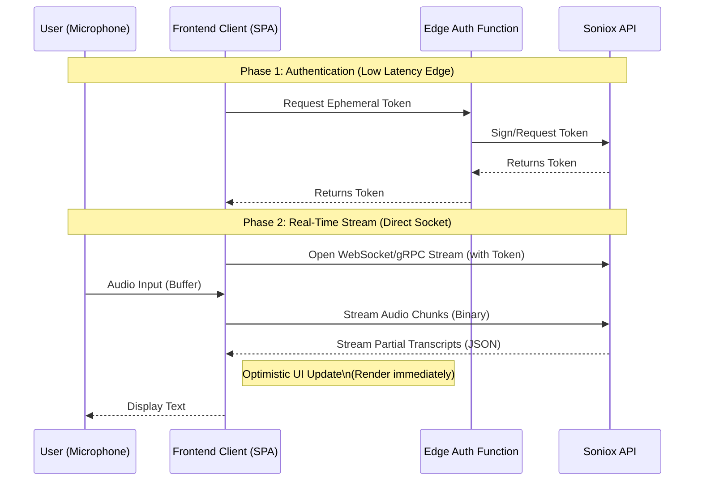
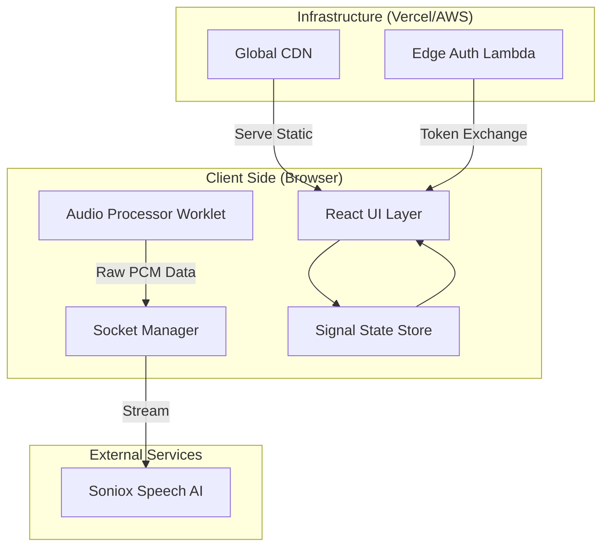

# Soniox Real-Time IRL Translation Frontend Architecture


## 📋 Executive Summary

This document outlines the architectural solution for a high-performance, low-latency frontend application designed to consume the **Soniox API** for IRL (In-Real-Life) translation. The primary KPI for this architecture is **latency minimization**—ensuring the time between voice input and text display is imperceptible.

To achieve "best-in-class" speed, we utilize **WebSockets/gRPC-Web** for streaming, **Rust/WASM** for potential heavy parsing (if needed across languages), and a **Signal-based** state management system to minimize React render cycles.

---

## 🛠 Technology Stack

The stack is chosen specifically for **speed** and **low overhead**.

| Component | Technology | Rationale |
|-----------|------------|-----------|
| **Core Framework** | **React 19 (or SolidJS)** | React 19's compiler or Solid's fine-grained reactivity ensures minimal DOM overhead during rapid text updates. |
| **Build Tool** | **Vite** | Instant server start and optimized HMR for rapid development; Rollup for production builds. |
| **API Protocol** | **gRPC-Web / WebSockets** | Soniox streams data; HTTP/1.1 polling is unacceptable. Persistent bidirectional connections are required. |
| **State Management** | **Zustand / Signals** | We need to update *individual text nodes* without re-rendering the entire conversation tree. |
| **Styling** | **TailwindCSS** | Zero runtime overhead styling. |
| **Virtualization** | **TanStack Virtual** | To handle potentially infinite conversation logs without DOM bloating. |
| **Infrastructure** | **Vercel Edge / Cloudflare** | Deploy assets to the edge to reduce Time-To-First-Byte (TTFB). |

---

## 🏗 Architecture Proposals

### 1. High-Level Data Flow

The architecture prioritizes a **direct-to-client** model where possible to avoid "middleware latency". The backend serves only to sign authentication tokens, while the frontend connects directly to the Soniox streaming servers.



### 2. Infrastructure Diagram

We propose a **Serverless/Edge** infrastructure to keep maintenance low and global availability high.



---

## 🚀 Performance Strategy (Low Latency)

To meet the requirement of showing translation "as fast as possible", we implement the following:

1.  **AudioWorklet API**: Processing microphone input on a separate thread from the main UI thread to prevent blocking during heavy rendering.
2.  **Speculative Rendering**: If Soniox provides "partial" results (unfinalized text), we display them immediately in a greyed-out state and replace them with "final" results when available. This reduces *perceived* latency.
3.  **Memoized Components**: Using `React.memo` or Signals to ensure that when a new word arrives, only the specific line or word updates, not the entire chat history.
4.  **Network Protocol**: Use **HTTP/2** or **QUIC** if supported by the provider, otherwise standard **WSS** (Secure WebSockets).

---

## 🌍 "All Programming Languages" / Polyglot Support

If the requirement implies displaying code snippets or handling multi-language syntax highlighting within the translation stream:

*   **Tree-sitter (WASM)**: We load a WASM-based parser to detect programming languages in real-time within the text stream.
*   **Lazy Loading**: Language grammars are loaded only when detected to keep the initial bundle size small.

---

## 📂 Project Structure

```bash
/src
  /api          # gRPC/WebSocket client definitions
  /audio        # AudioWorklet processors (off-main-thread processing)
  /components
    /LiveStream # The main optimized text renderer
    /VirtualList # Handling long history
  /store        # Zustand/Signal store for high-frequency updates
  /hooks        # useAudioStream, useTranscription
```

## 🏁 Getting Started

1.  **Clone the repository**
2.  `npm install`
3.  Set `VITE_SONIOX_API_KEY` in `.env`
4.  `npm run dev`

---

*Generated by Senior Architect Agent - 2026*
